# Flexible Content Guide For Content Upload

This guide is written for content editors.

Use it to answer one simple question:

`Which flexible content section should I use for this page section?`

How to use this guide:
- find the page
- find the section screenshot
- use the flexible content section listed under it
- follow the short notes for what to fill in

Important:
- use the sections listed in this guide
- if a section does not need an image, leave the image field empty when the note says that is allowed

## Main Flexible Content Sections You Should Use

### `Hero Section`

Use for:
- large banner/hero sections at the top of a page

### `Overview Section (Left Image + Right Content)`

Use for:
- overview sections with image on the left and content on the right
- overview sections that can also become full width if no image is uploaded

Typical fields to fill:
- Section Link, if needed
- Section Heading
- Highlight Text
- Body Content
- Supporting Links Content, if needed
- Section Image, if needed
- Journey Callout, if needed
- Additional Links, if needed

### `Illustration + Text Split Section`

Use for:
- standard split sections with one image/illustration and one text column
- sections where the image may appear on the left or right

Typical fields to fill:
- Image Position
- Section Heading
- Highlight Text, if needed
- Body Content
- Supporting Links Content, if needed
- List Style Variant, if using a list
- List Items, if needed
- Section Image

Notes:
- for `Default` lists, enter one simple bullet per row using `Bullet Text`
- for `Highlighted Lead Text` lists, enter `Lead Text` and `Supporting Text` separately for each row

### `Media + Content Section`

Use for:
- sections that combine media and content
- sections where the image can appear on the left or right
- sections with one or more text blocks under the same main heading

Typical fields to fill:
- Section Heading
- Content Blocks
- Supporting Links Content, if needed
- Media Position
- Bottom Divider, if needed
- Image

### `Full Width Content Section`

Use for:
- full-width text sections
- sections with a main heading, section heading, highlight text, and body content

Typical fields to fill:
- Main Heading, if needed
- Section Heading
- Callout Type
- Simple Intro Text
- Linked / Rich Callout, if needed
- Simple Intro Style
- Body Content

Notes:
- use `Simple Intro Text` for short plain text intros
- use `Linked / Rich Callout` when the bordered callout needs links, emphasis, or multiple paragraphs
- `Callout Type` should be set first so only the relevant intro field is shown

### `Full Width Image + Highlighted List Section`

Use for:
- full-width sections with a heading, a large image, paragraph content, a highlighted lead-text list, and a pink note box

Typical fields to fill:
- Section Heading
- Top Image
- Body Content
- List Intro
- List Items
- Bottom Highlight Note

### `Callout + List Section`

Use for:
- full-width soft background sections
- sections with a heading, highlight text, short body content, and bullet list

Typical fields to fill:
- Section Heading
- Highlight Text
- Body Content
- List Items

### `Request Appointment`

Use for:
- urgent appointment / CTA form section
- embedded forms that may be either click-to-open or always visible

Typical fields to fill:
- Button Text
- Form Embed Code

Notes:
- if `Button Text` is filled, the button is shown and the form opens on click
- if `Button Text` is left empty, the form is shown by default with no button

### `Cancer Journey Timeline Section`

Use for:
- Cancer Journey style pages with a centered intro followed by an alternating timeline of stages

Typical fields to fill:
- Intro Heading
- Intro Content
- Timeline Items

Timeline item fields:
- Stage Title
- Stage Image
- Body Content
- Optional Reading Heading
- Optional Reading Content

Notes:
- timeline stage alignment alternates automatically in the template
- use Optional Reading fields only when a stage needs an extra link or supporting line

### `Recovery Guide Section`

Use for:
- structured recovery or aftercare sections with a heading, intro callout, supporting body copy, and grouped bullet guidance

Typical fields to fill:
- Section Heading
- Highlight Text
- Body Content
- Guide Groups

Guide group fields:
- Group Heading
- Group Items

Guide item fields:
- Lead Text
- Supporting Text

Notes:
- use this when a section has grouped headings like `Post-surgery you can`, `You should`, and `Things to avoid`
- each bullet item is structured so the lead phrase stays styled consistently

### `Additional Information Links`

Use for:
- related links section with image on the left and two link groups on the right

## Home Page

Source:
- `simontsao-html/index.html`

### Section 1: Homepage Hero

Screenshot:
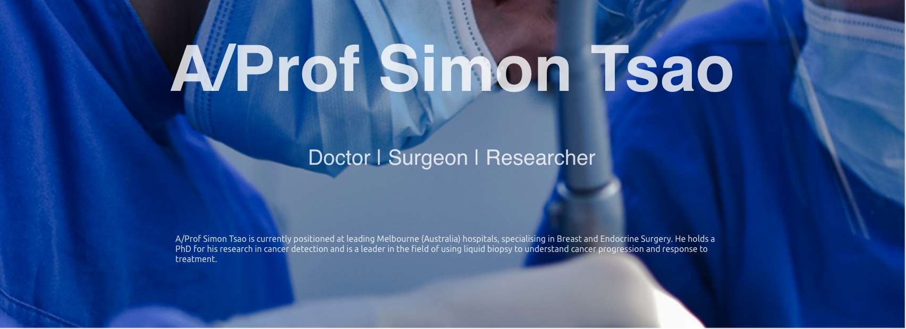

Use this flexible content:
- `Hero Section`

What to fill in:
- Hero Title
- Hero Kicker
- Hero Summary
- Background Image

Notes:
- this is the large top banner with background image

### Section 2: Specialist in Breast, Endocrine & General Surgery – Melbourne

Screenshot:
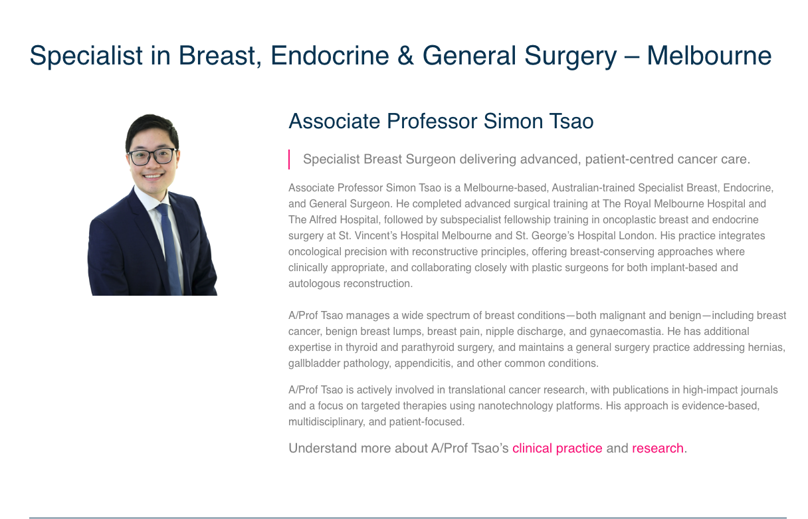

Use this flexible content:
- `Overview Section (Left Image + Right Content)`

What to fill in:
- Section Link
- Section Heading
- Highlight Text
- Body Content
- Supporting Links Content
- Section Image

Notes:
- this section uses a linked title above the main content

### Section 3: Breast Cancer Surgery & Oncoplastic Surgery in Melbourne

Screenshot:
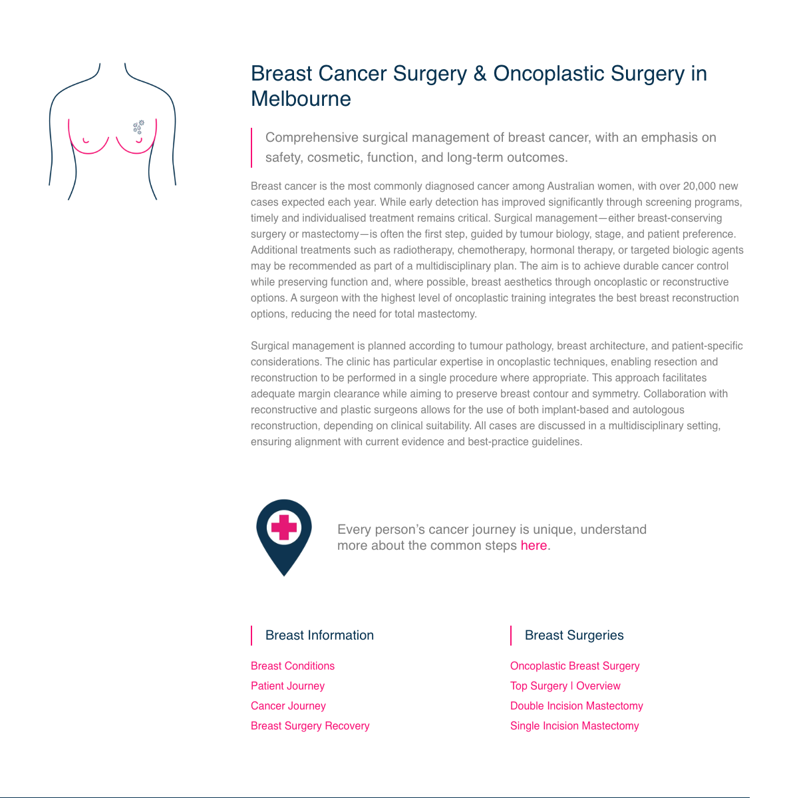

Use this flexible content:
- `Overview Section (Left Image + Right Content)`

What to fill in:
- Section Heading
- Highlight Text
- Body Content
- Section Image
- Journey Callout
- Additional Links

Notes:
- this section uses the extra Journey Callout fields
- this section also uses the Additional Links fields

### Section 4: Gender-Affirming Top Surgery

Screenshot:
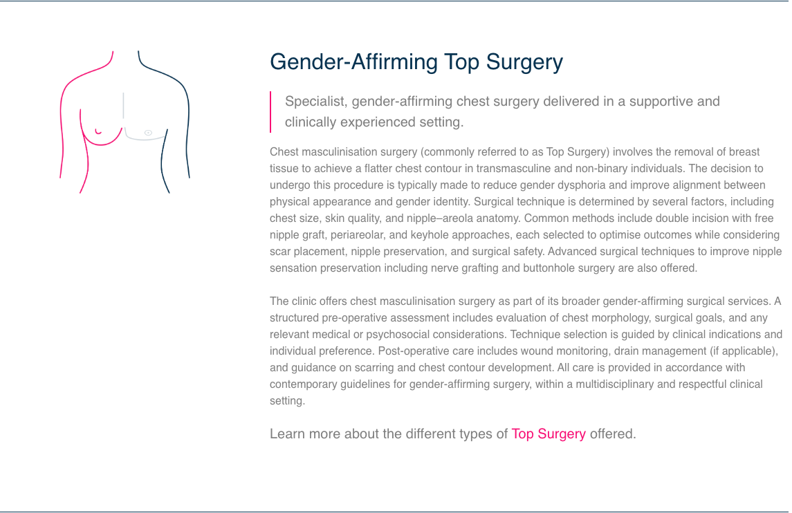

Use this flexible content:
- `Overview Section (Left Image + Right Content)`

What to fill in:
- Section Heading
- Highlight Text
- Body Content
- Supporting Links Content
- Section Image

Notes:
- use this for the homepage top surgery overview block

### Section 5: Request an Urgent Appointment

Screenshot:
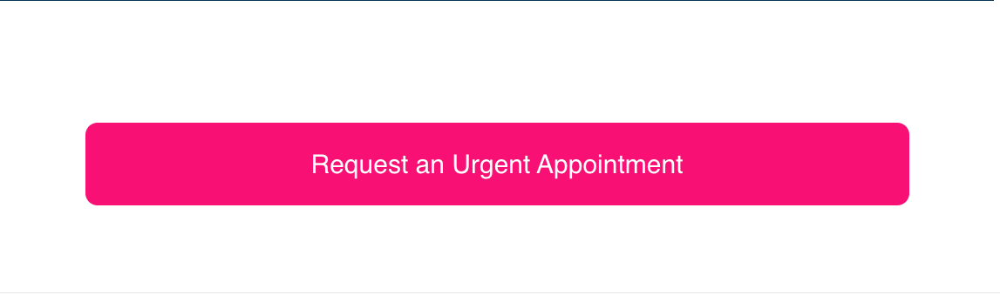

Use this flexible content:
- `Request Appointment`

What to fill in:
- Button Text
- Form Embed Code

Notes:
- use this for the large pink appointment CTA/button area

### Section 6: Links to Additional Information

Screenshot:
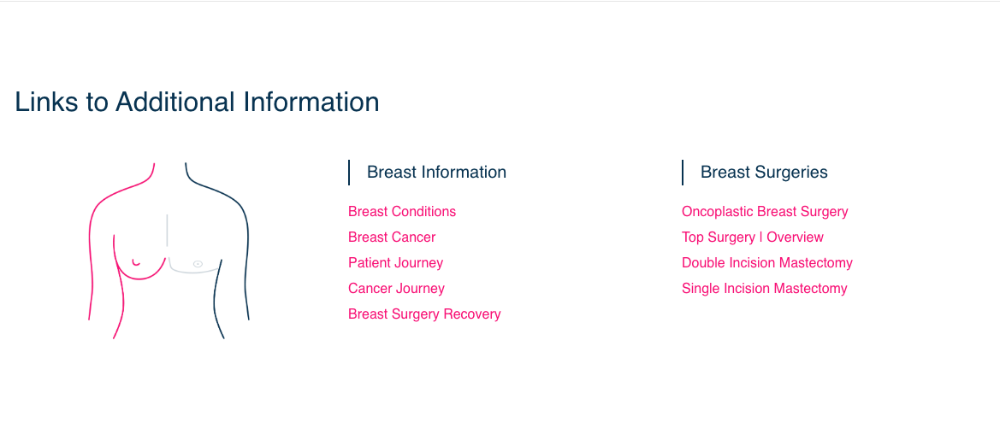

Use this flexible content:
- `Additional Information Links`

What to fill in:
- Section Heading
- Section Image
- Additional Links Source
- Information Group Heading
- Surgeries Group Heading
- Information Links
- Surgeries Links

Notes:
- if you want manual links, keep `Additional Links Source` on Manual
- if you want shared links from Site Settings, switch it to Shared

## About Page

Source:
- `simontsao-html/about/index.html`

### Section 1: Lead About Section

Screenshot:
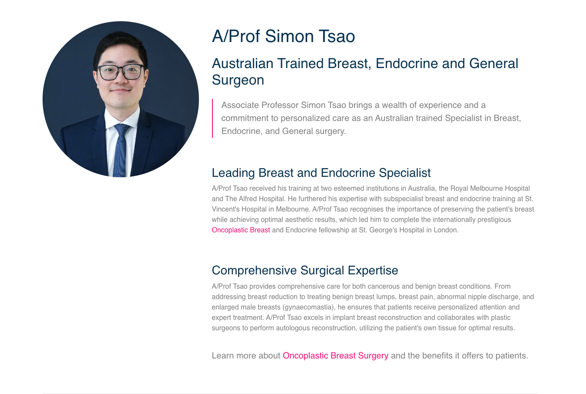

Use this flexible content:
- `About Specialist Intro`

### Section 2: Medical and Cancer Research

Screenshot:
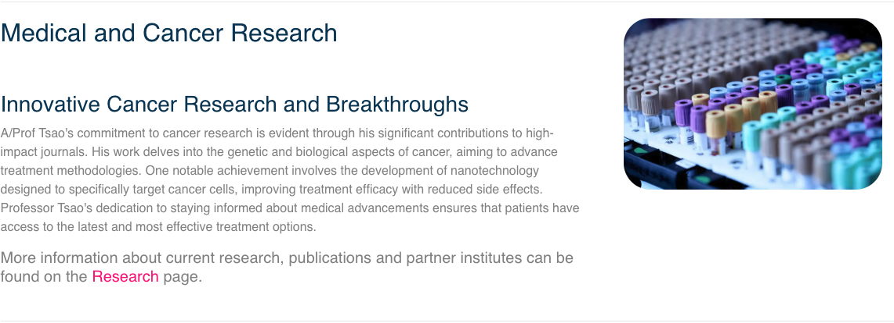

Use this flexible content:
- `Media + Content Section`

What to fill in:
- Section Heading
- one Content Block
- Supporting Links Content
- Media Position: `Right`
- Bottom Divider: `Shown`
- Image

Notes:
- use this reusable section for the About page research block
- this replaces the old `About Research Overview` section

### Section 3: Treatment Principles

Screenshot:
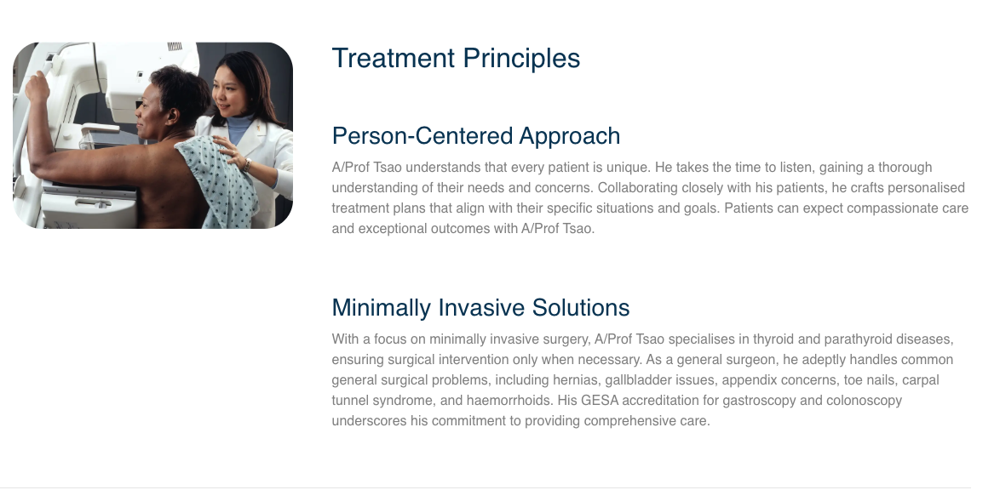

Use this flexible content:
- `Media + Content Section`

What to fill in:
- Section Heading
- two Content Blocks
- Media Position: `Left`
- Bottom Divider: `Hidden`
- Image

Notes:
- use this reusable section for the About page treatment principles block
- this replaces the old `About Treatment Principles` section

### Section 4: Affiliations

Screenshot:
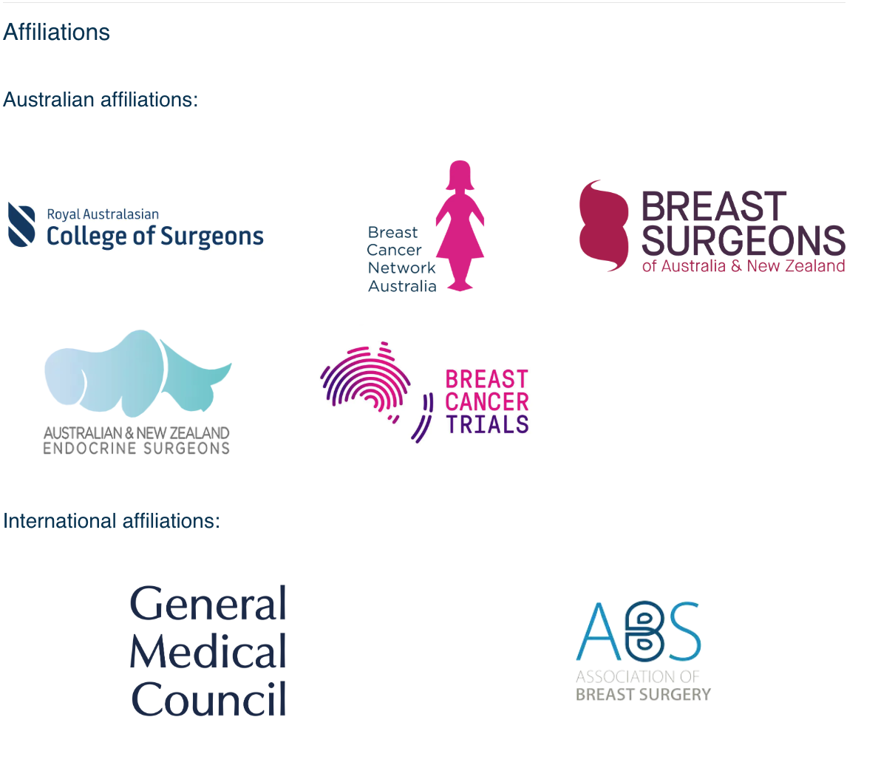

Use this flexible content:
- `About Affiliations`

## Breast Conditions Page

Source:
- `simontsao-html/breast-conditions/index.html`

### Section 1: Page Hero

Use this flexible content:
- `Inner Hero` or `Hero Section`

### Section 2: Breast Conditions Intro

Screenshot:
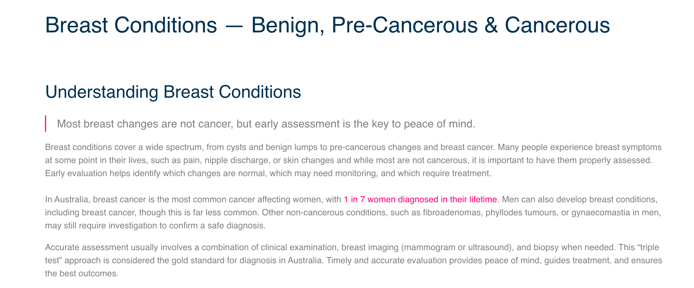

Use this flexible content:
- `Full Width Content Section`

What to fill in:
- Main Heading
- Section Heading
- Highlight Text
- Body Content

### Section 3: When to Seek Help

Screenshot:
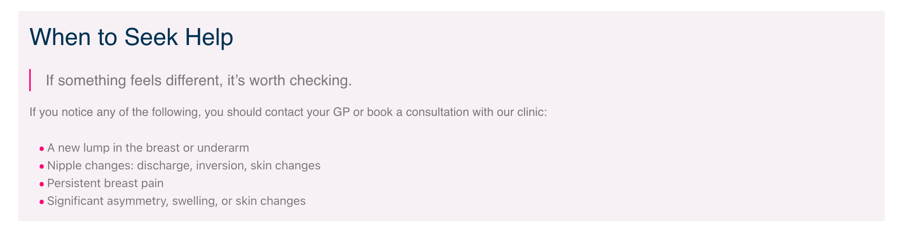

Use this flexible content:
- `Callout + List Section`

What to fill in:
- Section Heading
- Highlight Text
- Body Content
- List Items

### Section 4: Breast Cancer

Screenshot:
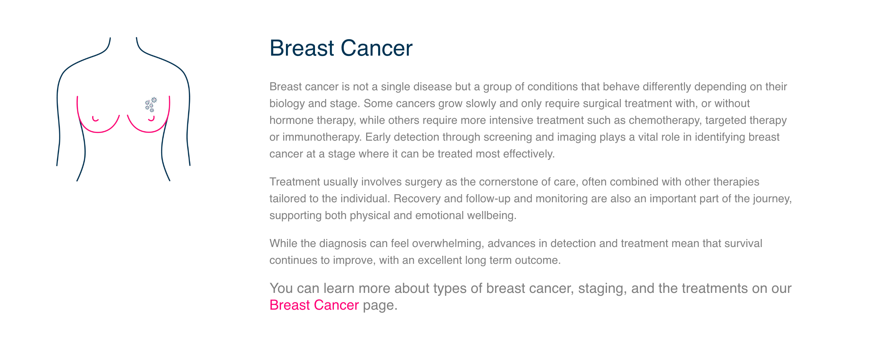

Use this flexible content:
- `Illustration + Text Split Section`

What to fill in:
- Section Heading
- Body Content
- Supporting Links Content, if needed
- Section Image

### Section 5: Breast Reduction Surgery

Screenshot:
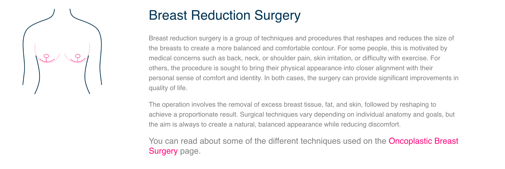

Use this flexible content:
- `Illustration + Text Split Section`

What to fill in:
- Section Heading
- Body Content
- Supporting Links Content, if needed
- Section Image

### Section 6: Benign & Pre-Cancerous Breast Conditions

Screenshot:
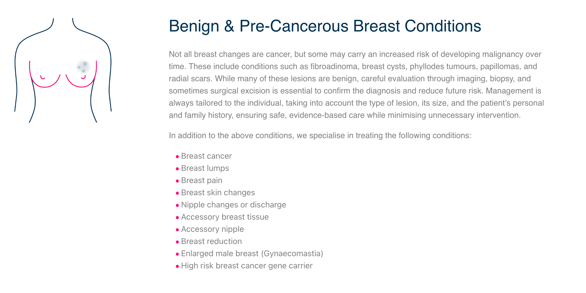

Use this flexible content:
- `Illustration + Text Split Section`

What to fill in:
- Section Heading
- Body Content
- List Items
- Section Image

### Section 7: Simon Tsao - Cancer Treatment Specialist

Screenshot:
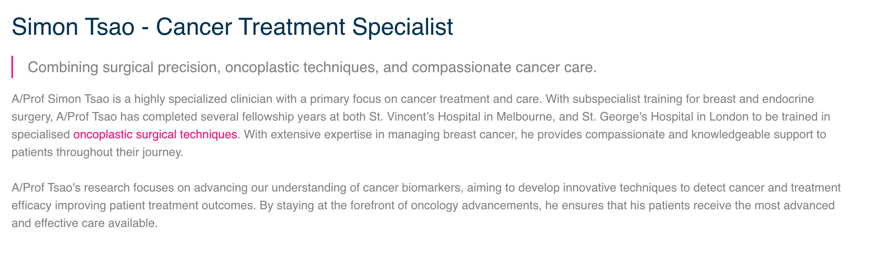

Use this flexible content:
- `Full Width Content Section`

What to fill in:
- Section Heading
- Highlight Text
- Body Content

Notes:
- this is a full-width text section with no image

### Section 8: Links to Additional Information

Screenshot:
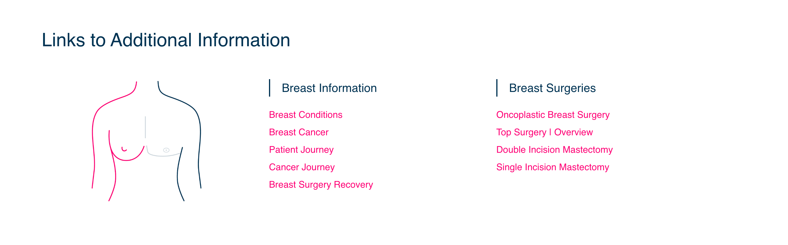

Use this flexible content:
- `Additional Information Links`

## Top Surgery Page

Source:
- `simontsao-html/top-surgery/index.html`

### Section 1: Page Hero

Use this flexible content:
- `Inner Hero`

Notes:
- no screenshot is saved yet for this section in `docs/top-surgery`

### Section 2: Top Surgery or Gender Masculinisation Surgery

Screenshot:
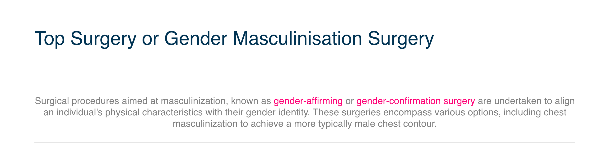

Use this flexible content:
- `Centered Intro Section`

What to fill in:
- Main Heading
- Intro Text

### Section 3: Understanding Top Surgery

Screenshot:
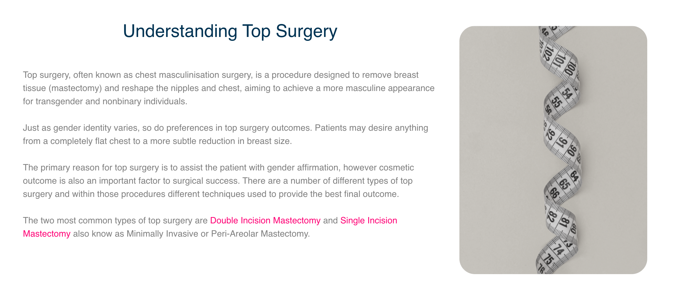

Use this flexible content:
- `Reactive Card + Content Section`

What to fill in:
- Section Heading
- Heading Level: `H2`
- Body Content
- Card Image
- Card Position: `Right`
- Hover Background Color

Notes:
- use this for sections with the interactive hover card image

### Section 4: Indications for Top Surgery

Screenshot:
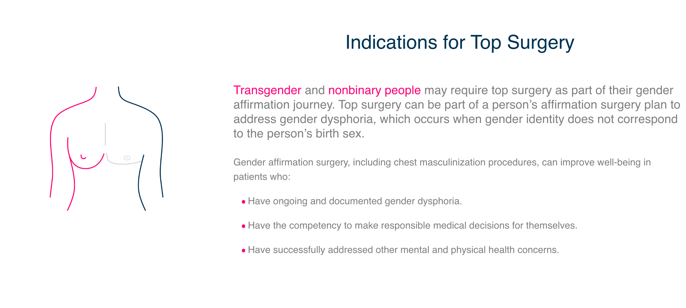

Use this flexible content:
- `Illustration + Text Split Section`

What to fill in:
- Style Variant: `Centered Intro`
- Section Heading
- Intro Text
- Body Content
- List Items
- Section Image

### Section 5: Top Surgery, Breast Disease and Breast Cancer

Screenshot:
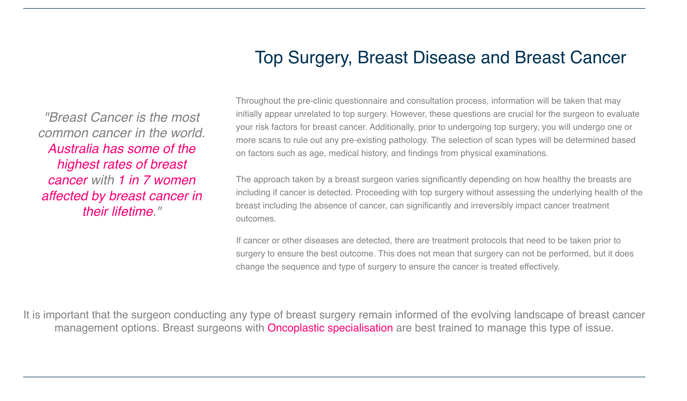

Use this flexible content:
- `Quote + Content Section`

What to fill in:
- Section Heading
- Quote Content
- Body Content
- Bottom Note

### Section 6: Types of Top Surgery

Screenshot:
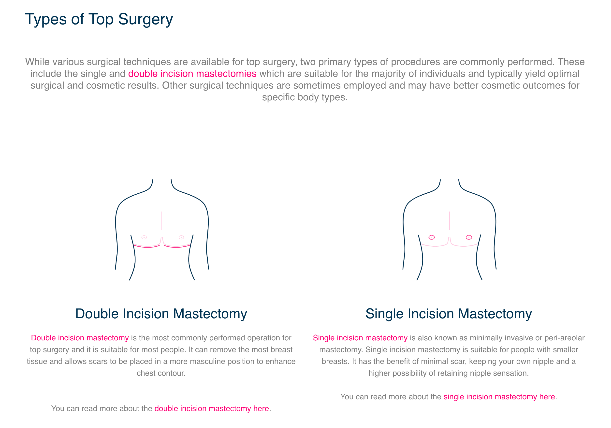
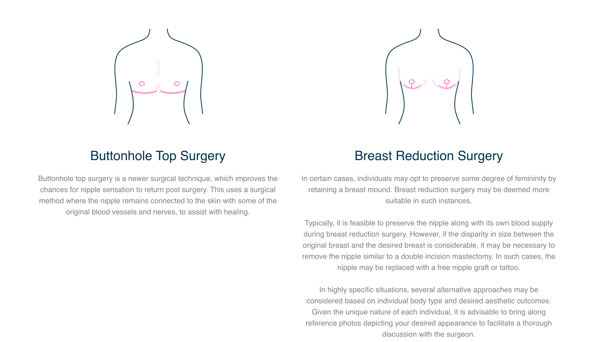

Use this flexible content:
- `Heading + Intro + Card Grid`

What to fill in:
- Section Heading
- Intro Text
- Cards

Notes:
- add 4 cards for this section

### Section 7: Advanced Sensory Preservation Techniques

Screenshot:
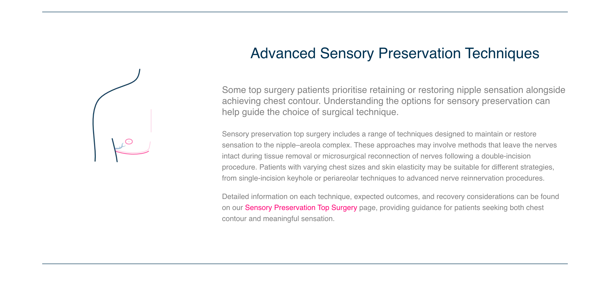

Use this flexible content:
- `Illustration + Text Split Section`

What to fill in:
- Style Variant: `Centered Intro`
- Section Heading
- Intro Text
- Body Content
- Supporting Links Content
- Section Image

### Section 8: Patient Underlying Health and Consent

Screenshot:
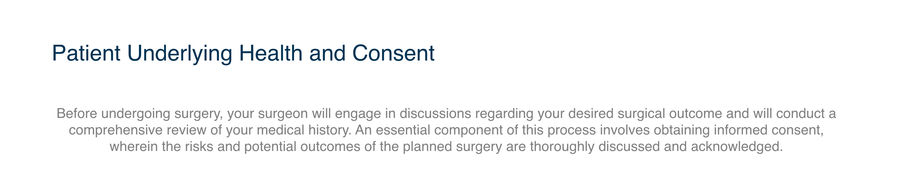

Use this flexible content:
- `Centered Intro Section`

What to fill in:
- Main Heading
- Intro Text

### Section 9: Body Composition and Weight

Screenshot:
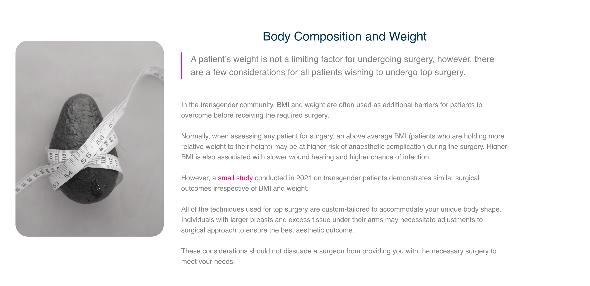

Use this flexible content:
- `Reactive Card + Content Section`

What to fill in:
- Section Heading
- Heading Level: `H3`
- Highlight Text
- Body Content
- Card Image
- Card Position: `Left`
- Hover Background Color
- Card Top Spacing: `Shown`

### Section 10: Age of Consent

Screenshot:
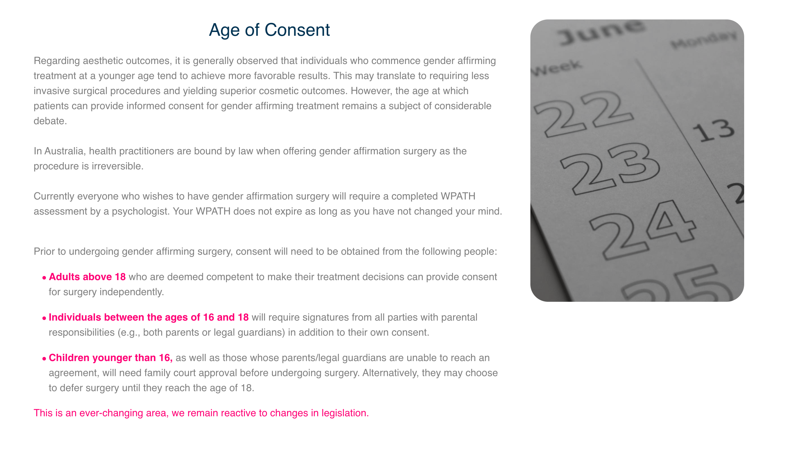

Use this flexible content:
- `Reactive Card + Content Section`

What to fill in:
- Section Heading
- Heading Level: `H3`
- Body Content
- Bottom Note
- Card Image
- Card Position: `Right`
- Hover Background Color

Notes:
- add the consent bullet points inside Body Content

### Section 11: Prior to your appointment

Screenshot:
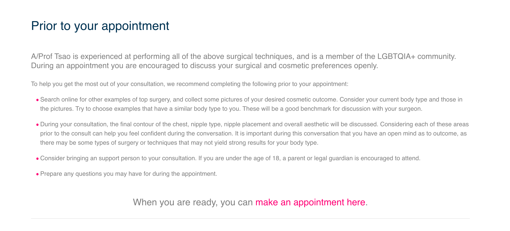

Use this flexible content:
- `Heading + Intro + List + CTA`

What to fill in:
- Section Heading
- Intro Text
- Body Content
- List Items
- CTA Content

### Section 12: Additional Resources

Screenshot:
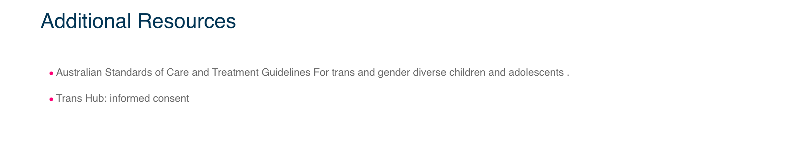

Use this flexible content:
- `Heading + List Section`

What to fill in:
- Section Heading
- List Items

### Section 13: Links to Additional Information

Screenshot:
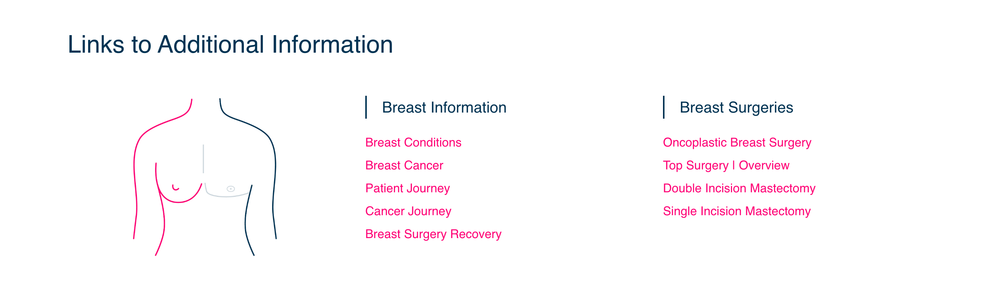

Use this flexible content:
- `Additional Information Links`

## Research Page

Source:
- `simontsao-html/research/index.html`

### Section 1: Research Hero

Screenshot:
- no screenshot saved yet in `docs/research`

Use this flexible content:
- `Inner Hero`

What to fill in:
- Hero Title
- Background Image

Notes:
- use this for the large parallax Research banner
- leave Hero Summary empty unless a summary is intentionally added to the design

### Section 2: Research Overview

Screenshot:
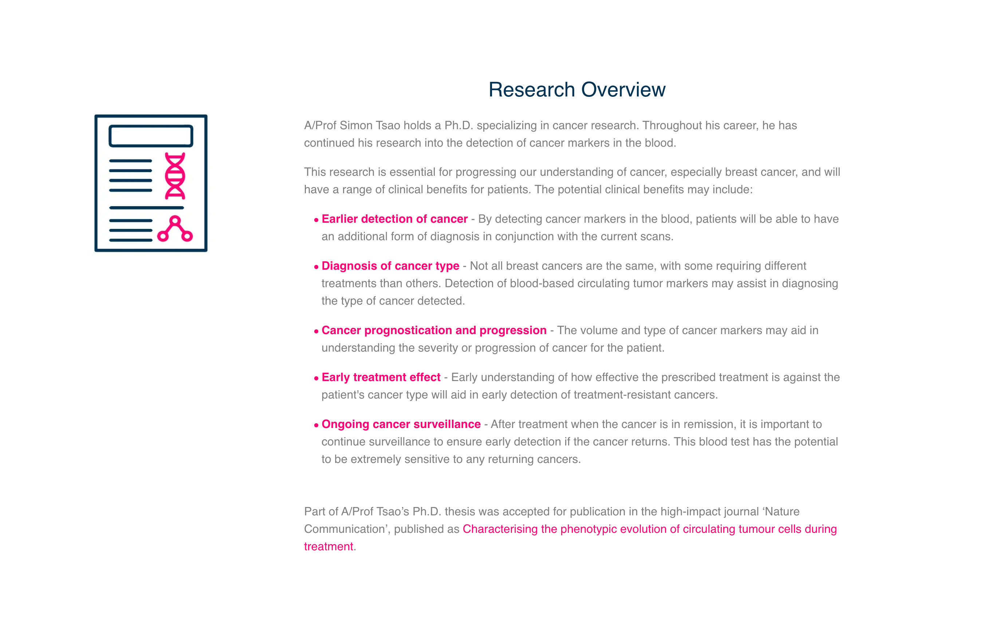

Use this flexible content:
- `Illustration + Text Split Section`

What to fill in:
- Heading Alignment: `Center`
- Section Heading
- Body Content
- List Style Variant: `Highlighted Lead Text`
- List Items
- Supporting Links Content
- Section Image

Notes:
- keep the main explanatory paragraphs in Body Content
- add the clinical benefits as List Items
- use Supporting Links Content for the publication sentence and external journal link shown under the list

### Section 3: Understanding Cancer Detection

Screenshot:
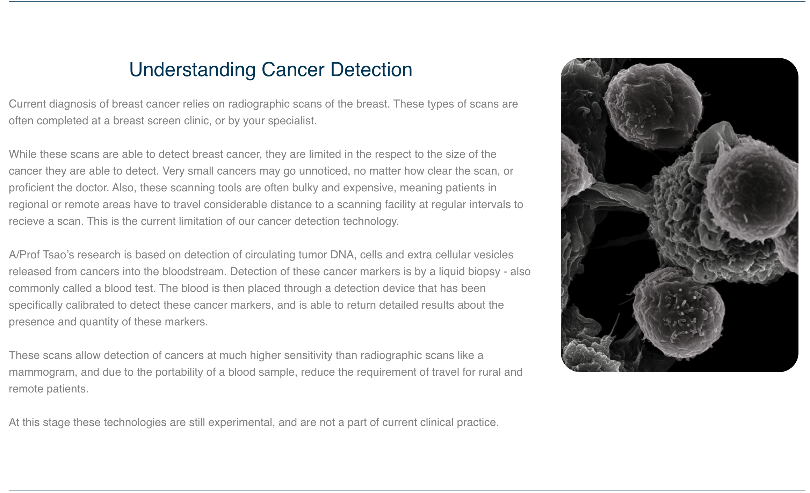

Use this flexible content:
- `Reactive Card + Content Section`

What to fill in:
- Section Heading
- Heading Level: `H3`
- Body Content
- Card Image
- Card Position: `Right`
- Hover Background Color

Notes:
- this section does not need Highlight Text or Bottom Note unless the content changes later

### Section 4: Refining the Science

Screenshot:
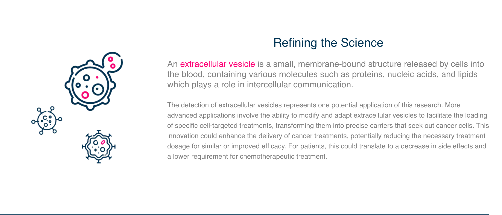

Use this flexible content:
- `Illustration + Text Split Section`

What to fill in:
- Style Variant: `Centered Intro`
- Section Heading
- Intro Text
- Body Content
- Section Image
- Add Top Spacing: `Shown`, if needed to match the static layout

Notes:
- use Intro Text for the extracellular vesicle definition line

### Section 5: Research Partners and Collaboration

Screenshot:
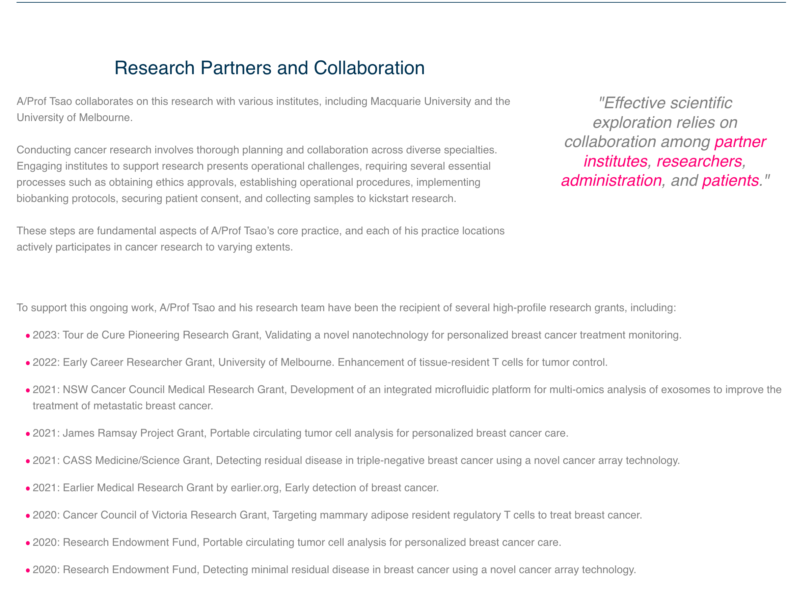

Use this flexible content:
- `Quote + Content Section`

What to fill in:
- Section Heading
- Quote Content
- Quote Position: `Right`
- Body Content
- Bottom Content Style: `Body Content Block`
- Bottom Content

Notes:
- keep the introductory collaboration paragraphs in Body Content
- add the grants intro paragraph and grants list in Bottom Content so they appear as a full-width block below the two-column section

### Section 6: Research Publications

Screenshot:
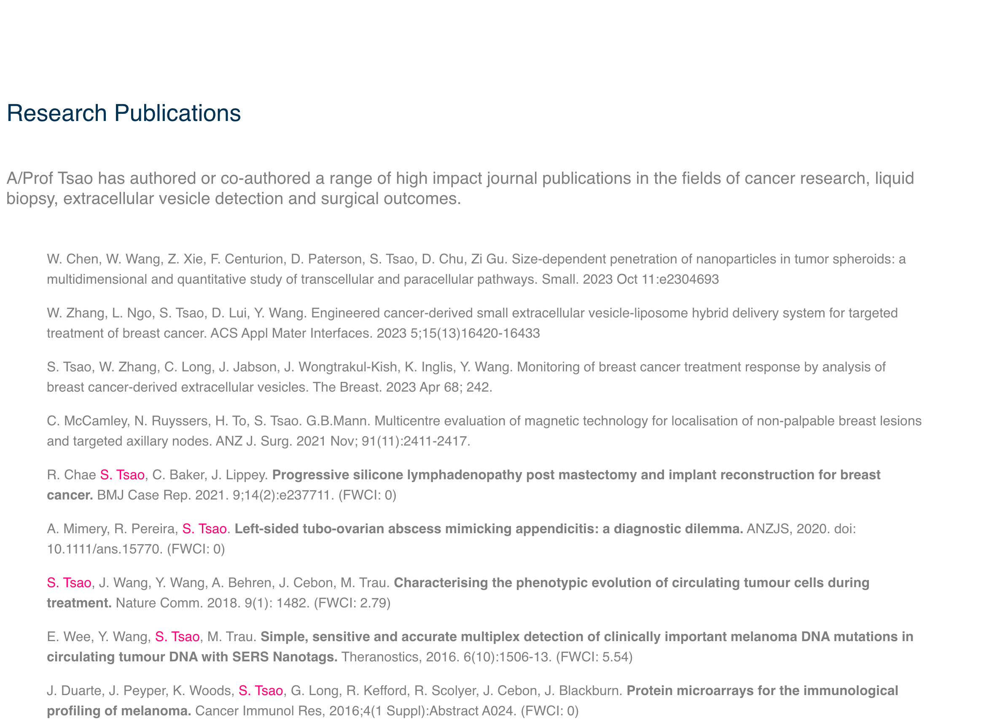

Use this flexible content:
- `Full Width Content Section`

What to fill in:
- Section Heading
- Highlighted / Intro Text
- Intro Text Style: `Intro Text`
- Body Content
- Secondary Content
- Bottom Note
- CTA Content

Notes:
- leave Main Heading empty
- leave Body Content empty unless extra content is needed between the intro and publication list
- use Highlighted / Intro Text for the short intro sentence shown under the heading
- use Secondary Content for the publication entries list
- use Bottom Note for the ORCiD and Scopus line
- use CTA Content for the final collaboration line

## Appointment Information Page (patient-information)

Source:
- `simontsao-html/patient-information/index.html`

### Section 1: Patient Journey Hero

Screenshot:
- add screenshot here

Use this flexible content:
- `Inner Hero`

What to fill in:
- Hero Title
- Hero Summary
- Background Image

Notes:
- use the Patient Journey banner image
- keep Hero Kicker empty

### Section 2: Making an Appointment

Screenshot:
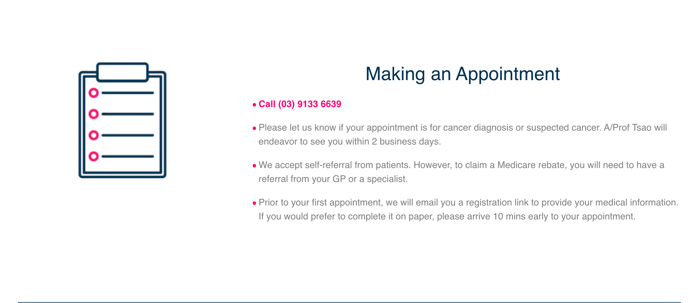

Use this flexible content:
- `Illustration + Text Split Section`

What to fill in:
- Heading Alignment: `Center`
- Section Heading
- List Style Variant: `Highlighted Lead Text`
- List Items
- Bottom Divider: `Shown`
- Section Image

Notes:
- leave Body Content empty unless extra context is needed above the list
- use the pink phone line as the first highlighted list item

### Section 3: Day of Your Appointment

Screenshot:
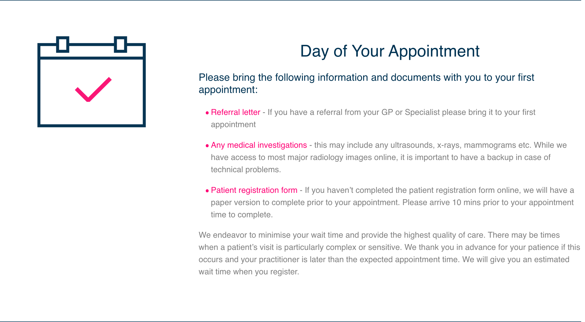

Use this flexible content:
- `Illustration + Text Split Section`

What to fill in:
- Heading Alignment: `Center`
- Section Heading
- Highlight Text
- List Style Variant: `Highlighted Lead Text`
- List Items
- Body Content
- Bottom Divider: `Shown`
- Section Image

Notes:
- use Highlight Text for the short line introducing the document checklist
- keep the closing wait-time paragraph in Body Content below the list

### Section 4: During Your Appointment

Screenshot:
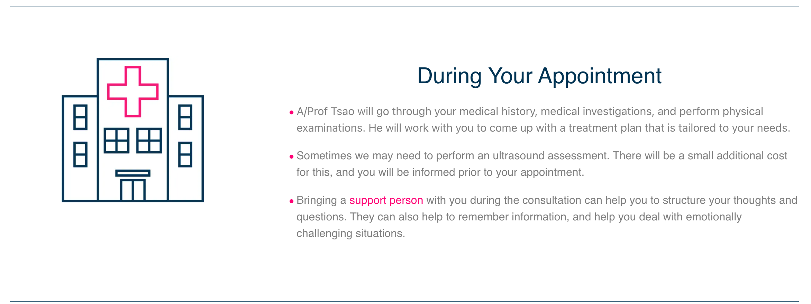

Use this flexible content:
- `Illustration + Text Split Section`

What to fill in:
- Heading Alignment: `Center`
- Section Heading
- List Style Variant: `Highlighted Lead Text`
- List Items
- Bottom Divider: `Shown`
- Section Image

Notes:
- keep the support person phrase highlighted inside the relevant list item

### Section 5: Medical Investigations

Screenshot:

Use this flexible content:
- `Illustration + Text Split Section`

What to fill in:
- Heading Alignment: `Center`
- Section Heading
- Body Content
- Bottom Divider: `Shown`
- Section Image

Notes:
- no list is needed for this section

### Section 6: Second Appointment

Screenshot:
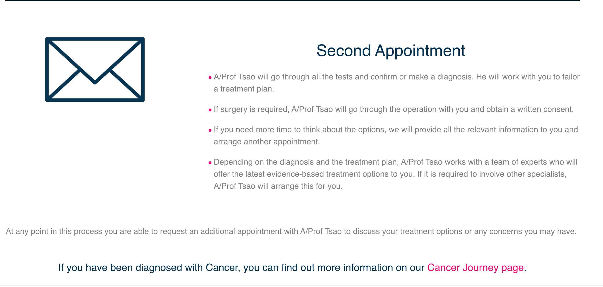

Use this flexible content:
- `Illustration + Text Split Section`

What to fill in:
- Heading Alignment: `Center`
- Section Heading
- List Items
- Section Image

Notes:
- keep all four outcome points as list items

### Section 7: Links to Additional Information

Screenshot:
- add screenshot here

Use this flexible content:
- `Additional Information Links`

## Contact Page

Source:
- `simontsao-html/contact-us/index.html`

### Section 1: Contact Hero

Screenshot:
- add screenshot here

Use this flexible content:
- `Inner Hero`

What to fill in:
- Hero Title
- Background Image

Notes:
- use `Contact the Clinic` as the hero title
- leave Hero Summary empty

### Section 2: Clinic Bookings

Screenshot:
- add screenshot here

Use this flexible content:
- `Full Width Content Section`

What to fill in:
- Main Heading
- Section Heading
- Highlighted / Intro Text
- Body Content

Notes:
- `Main Heading` = `Clinic Bookings`
- leave `Section Heading` empty
- leave `Body Content` empty
- leave secondary content fields empty

### Section 3: Contacting the Clinic

Screenshot:
- add screenshot here

Use this flexible content:
- `Callout + List Section`

What to fill in:
- `Section Heading` = `Contacting the Clinic`
- Highlight Text
- leave `Body Content` empty unless extra copy is needed above the list
- List Items

Notes:
- use `Highlight Text` for `Booking an appointment with our clinic is simple and confidential.`
- use `List Items` for the booking bullet points

### Section 4: Our Team Intro

Screenshot:
- add screenshot here

Use this flexible content:
- `Full Width Content Section`

What to fill in:
- Section Heading
- Highlighted / Intro Text

Notes:
- `Section Heading` = `Our Team`
- use `Highlighted / Intro Text` with `Intro Text Style: Intro Text`
- leave Main Heading empty
- leave Body Content empty

### Section 5: Emma Chittick Profile

Screenshot:
- add screenshot here

Use this flexible content:
- `About Specialist Intro`

What to fill in:
- Main Heading
- Subheading
- Highlight Text
- Specialist Content
- Profile Image

Notes:
- `Main Heading` = `Emma Chittick`
- `Subheading` = `(she/her)`
- `Highlight Text` = `Emma is the first point of contact for our patients and at the heart of the clinic.`
- put Emma’s biography paragraphs into `Specialist Content`
- leave the expertise fields empty unless more profile structure is needed later

### Section 6: Booking Form

Screenshot:
- add screenshot here

Use this flexible content:
- `Request Appointment`

What to fill in:
- Button Text
- Form Embed Code

Notes:
- use the Google Form embed iframe in `Form Embed Code`
- leave `Button Text` empty so the form displays by default
- the shared site footer already renders the contact details block, so do not duplicate that as a page-builder section

## Cancer Journey Page

Source:
- `simontsao-html/cancer-journey/index.html`

### Section 1: Cancer Journey Hero

Screenshot:
- add screenshot here

Use this flexible content:
- `Inner Hero`

What to fill in:
- Hero Title
- Background Image

Notes:
- use `Cancer Journey` as the hero title
- leave Hero Summary empty

### Section 2: Understanding Your Journey Timeline

Screenshot:
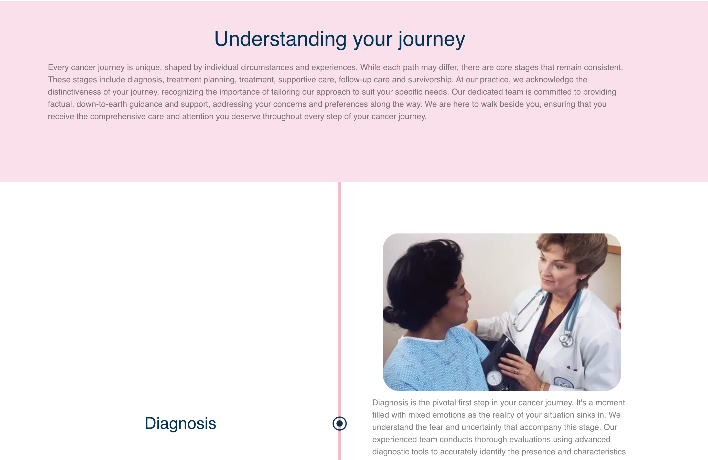

Use this flexible content:
- `Cancer Journey Timeline Section`

What to fill in:
- Intro Heading
- Intro Content
- Timeline Items

Timeline item fields:
- Stage Title
- Stage Image
- Body Content
- Optional Reading Heading
- Optional Reading Content

Notes:
- this section handles the soft intro block and the full alternating timeline in one reusable layout
- timeline item alignment should alternate automatically in the template
- `Additional Reading` should remain optional per item so it can be used on Diagnosis and omitted elsewhere

## Breast Cancer Page

Source:
- `simontsao-html/breast-cancer/index.html`

### Section 1: Breast Cancer Hero

Screenshot:
- add screenshot here

Use this flexible content:
- `Inner Hero`

What to fill in:
- Hero Title
- Background Image

Notes:
- use `Breast Cancer` as the hero title
- leave Hero Summary empty

### Section 2: Understanding Breast Cancer

Screenshot:
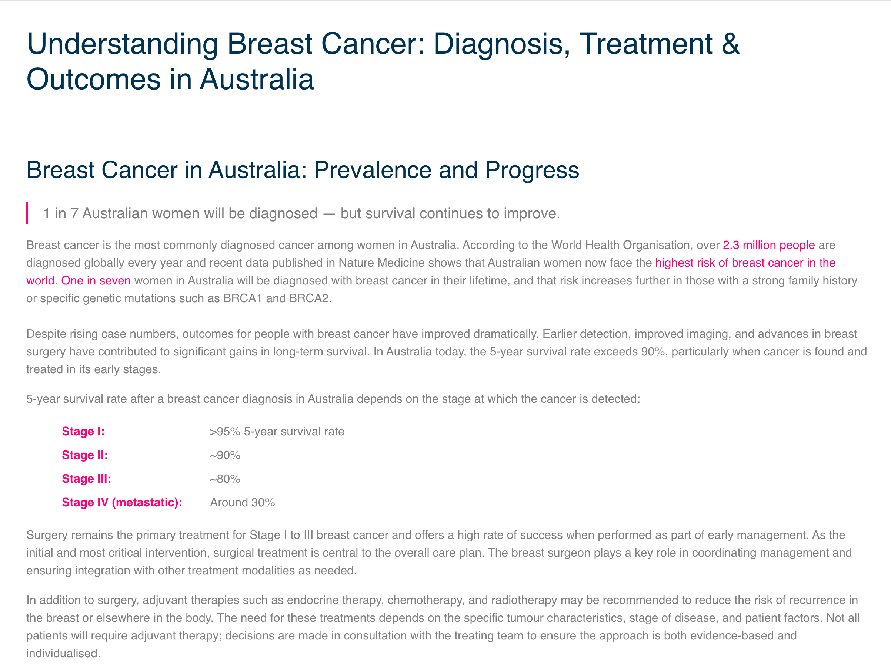

Use this flexible content:
- `Full Width Content Section`

What to fill in:
- Main Heading
- Section Heading
- Highlighted / Intro Text
- Body Content
- Secondary Content

Notes:
- `Main Heading` = `Understanding Breast Cancer: Diagnosis, Treatment & Outcomes in Australia`
- `Section Heading` = `Breast Cancer in Australia: Prevalence and Progress`
- use `Highlighted / Intro Text` for the `1 in 7 Australian women...` callout line
- use `Body Content` for the introductory paragraphs above the survival-rate table
- use `Secondary Content` for the survival-rate table and the paragraphs that follow it
- the existing `stats-table` styling can be reused inside WYSIWYG content

### Section 3: Types, Staging and Journey

Screenshot:
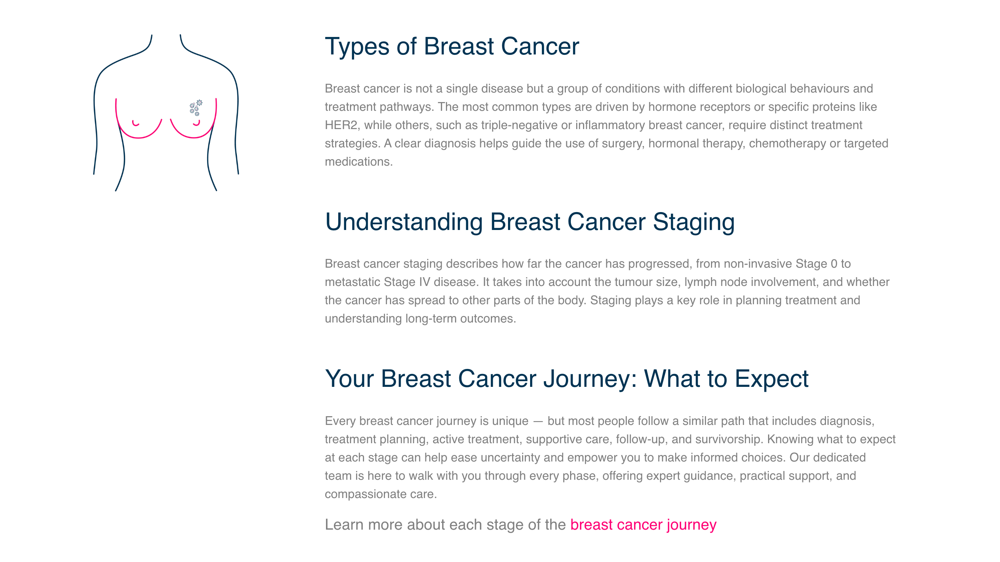

Use this flexible content:
- `Illustration + Text Split Section`

What to fill in:
- Section Heading
- Body Content
- Section Image

Notes:
- use `Section Heading` = `Types of Breast Cancer`
- keep all three content blocks in `Body Content` using WYSIWYG subheadings and paragraphs
- keep the final `Learn more about each stage...` line at the bottom of `Body Content`

### Section 4: Non-Cancerous and Pre-Cancerous Breast Conditions

Screenshot:
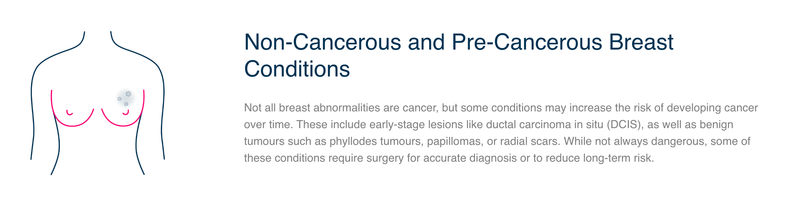

Use this flexible content:
- `Illustration + Text Split Section`

What to fill in:
- Section Heading
- Body Content
- Section Image

Notes:
- this is a simple image-left content section with no list

### Section 5: Breast Cancer References

Screenshot:
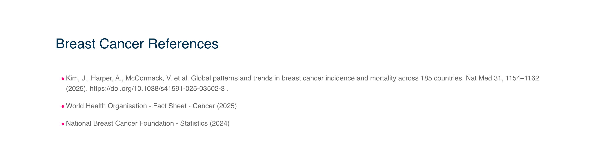

Use this flexible content:
- `Heading + List Section`

What to fill in:
- Section Heading
- List Items

Notes:
- add each reference as one list item with the source link included

### Section 6: Links to Additional Information

Screenshot:
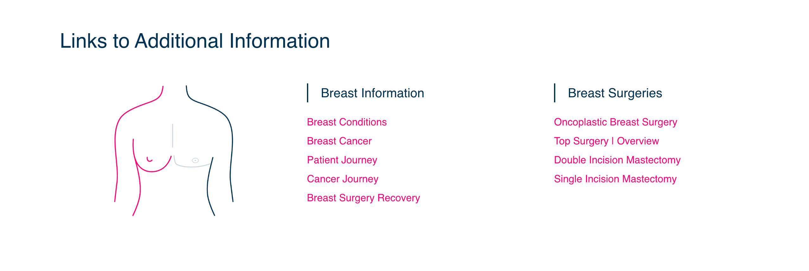

Use this flexible content:
- `Additional Information Links`

## Breast Surgery Recovery Page

Source:
- `simontsao-html/breast-surgery-recovery/index.html`

### Section 1: Breast Surgery Recovery Hero

Screenshot:
- add screenshot here

Use this flexible content:
- `Inner Hero`

What to fill in:
- Hero Title
- Background Image

Notes:
- use `Breast Surgery Recovery` as the hero title
- leave Hero Summary empty

### Section 2: Breast Surgery Wound Care and Recovery Intro

Screenshot:
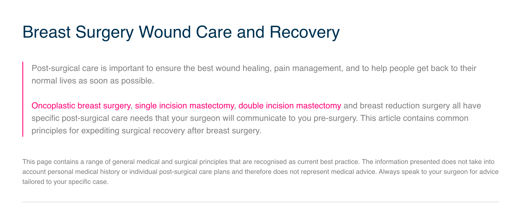

Use this flexible content:
- `Full Width Content Section`

What to fill in:
- Section Heading
- Callout Type: `Rich Callout With Links`
- Linked / Rich Callout
- Body Content

Notes:
- `Section Heading` = `Breast Surgery Wound Care and Recovery`
- use `Linked / Rich Callout` for the linked multi-paragraph bordered callout
- use `Body Content` for the medical disclaimer paragraph
- leave `Main Heading` empty

### Section 3: Breast Surgery Recovery Timeline

Screenshot:
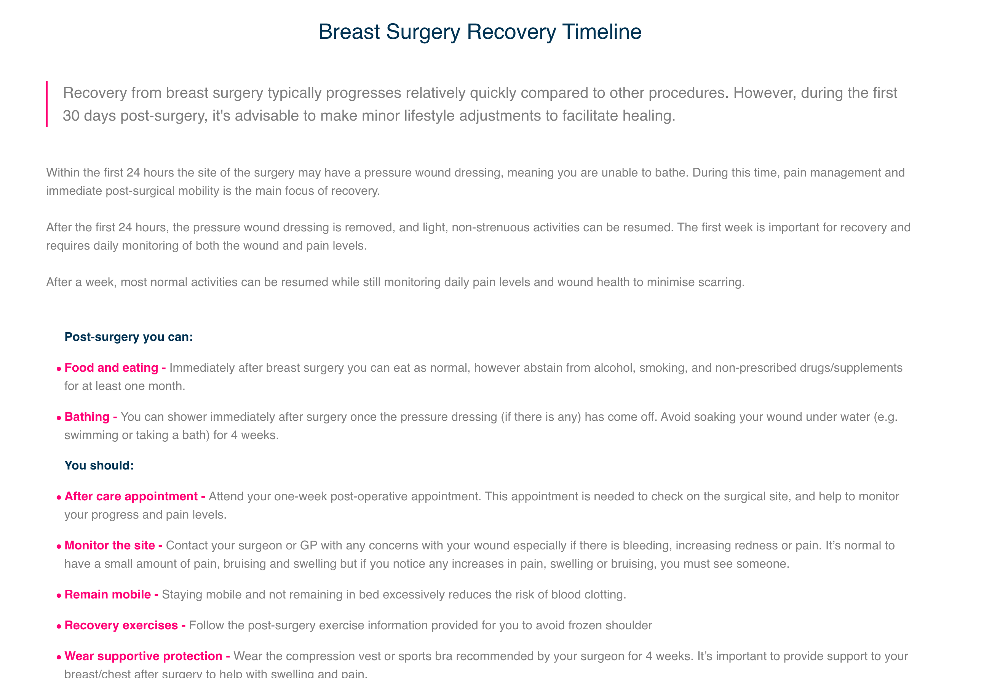

Use this flexible content:
- `Recovery Guide Section`

What to fill in:
- Section Heading
- Highlight Text
- Body Content
- Guide Groups

Notes:
- `Section Heading` = `Breast Surgery Recovery Timeline`
- use `Highlight Text` for the short recovery overview callout
- use `Body Content` for the recovery timeline paragraphs above the grouped guidance list
- add the grouped `Post-surgery you can`, `You should`, and `Things to avoid` blocks as structured `Guide Groups`

### Section 4: Pain Management

Screenshot:
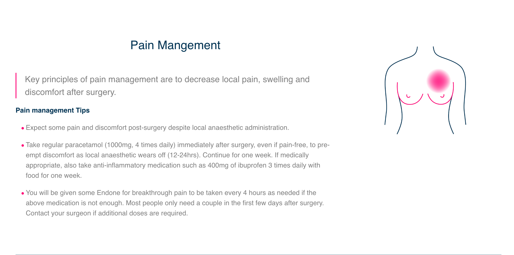

Use this flexible content:
- `Illustration + Text Split Section`

What to fill in:
- Image Position: `Right`
- Heading Alignment: `Center`
- Section Heading
- Highlight Text
- Body Content
- List Items
- Bottom Divider: `Shown`
- Section Image

Notes:
- `Section Heading` = `Pain Management`
- use `Highlight Text` for the pain-management callout sentence
- use `Body Content` for the `Pain management Tips` lead-in
- use `List Items` for the bullet points
- use the pain management illustration as the image

### Section 5: Wound Care

Screenshot:
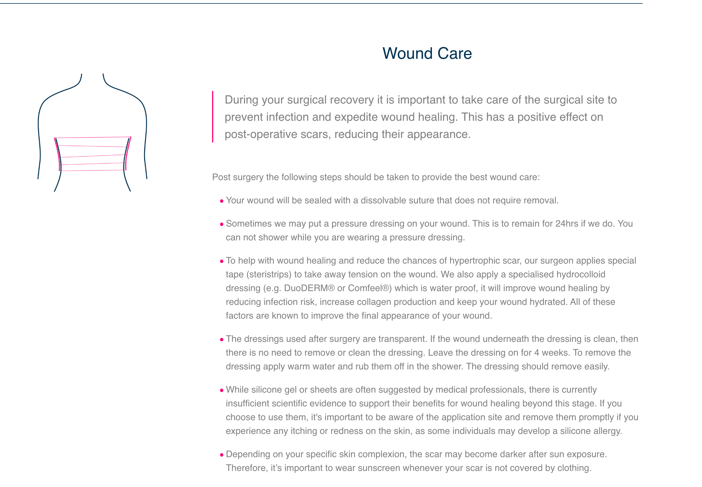

Use this flexible content:
- `Illustration + Text Split Section`

What to fill in:
- Image Position: `Left`
- Heading Alignment: `Center`
- Section Heading
- Highlight Text
- Body Content
- Section Image

Notes:
- `Section Heading` = `Wound Care`
- use `Highlight Text` for the wound-healing callout
- use `Body Content` for the intro sentence and the bullet list in WYSIWYG

### Section 6: Links to Additional Information

Screenshot:
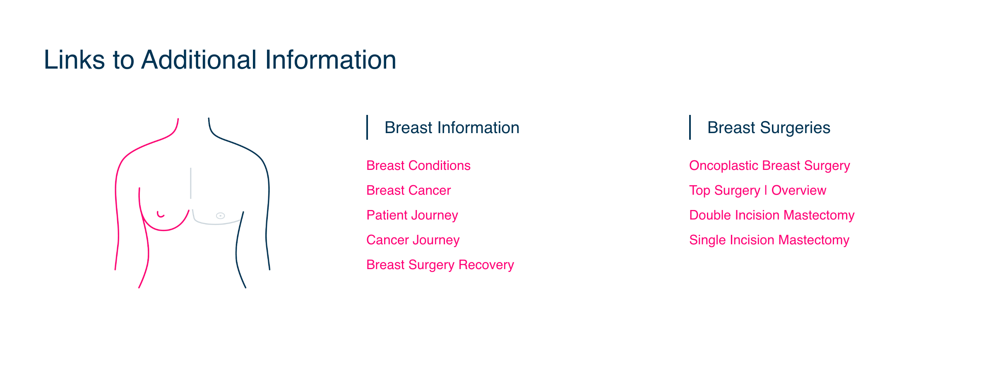

Use this flexible content:
- `Additional Information Links`

## Oncoplastic Breast Surgery Page

Source:
- `simontsao-html/oncoplastic-breast-surgery/index.html`

### Section 1: Page Hero

Screenshot:
- add screenshot here

Use this flexible content:
- `Inner Hero`

What to fill in:
- Hero Title
- Background Image

Notes:
- use `Oncoplastic Breast Surgery` as the hero title
- leave Hero Summary empty

### Section 2: What is Oncoplastic Breast Surgery?

Screenshot:
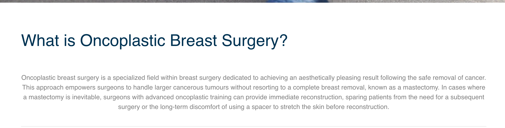

Use this flexible content:
- `Full Width Content Section`

What to fill in:
- Section Heading
- Body Content

Notes:
- `Section Heading` = `What is Oncoplastic Breast Surgery?`
- leave Main Heading and intro/callout fields empty

### Section 3: Traditional Breast Surgery

Screenshot:
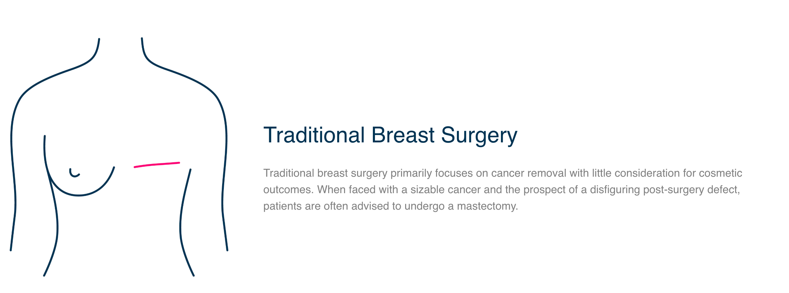

Use this flexible content:
- `Illustration + Text Split Section`

What to fill in:
- Image Position: `Left`
- Section Heading
- Body Content
- Section Image

Notes:
- leave Highlight Text empty

### Section 4: Oncoplastic Technique

Screenshot:
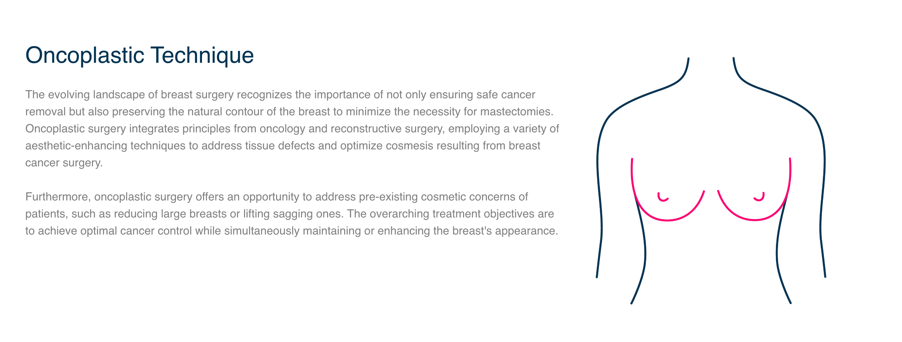

Use this flexible content:
- `Illustration + Text Split Section`

What to fill in:
- Image Position: `Right`
- Section Heading
- Body Content
- Section Image

Notes:
- keep all explanatory paragraphs in `Body Content`

### Section 5: What is the difference between normal breast surgery and oncoplastic breast surgery?

Screenshot:
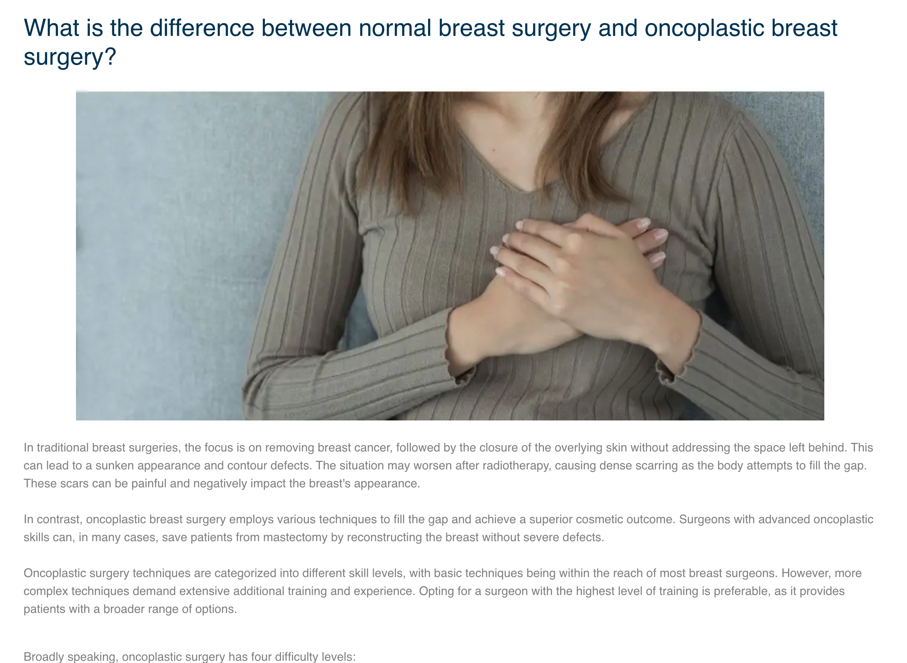

Use this flexible content:
- `Full Width Image + Highlighted List Section`

What to fill in:
- Section Heading
- Top Image
- Body Content
- List Intro
- List Items
- Bottom Highlight Note

Notes:
- use `Body Content` for the opening comparison paragraphs below the image
- use `List Intro` for the `Broadly speaking...` line
- use `List Items` for the four difficulty levels
- use `Bottom Highlight Note` for the final pink advisory paragraph

### Section 6: Immediate breast reconstruction techniques when a mastectomy is necessary.

Screenshot:
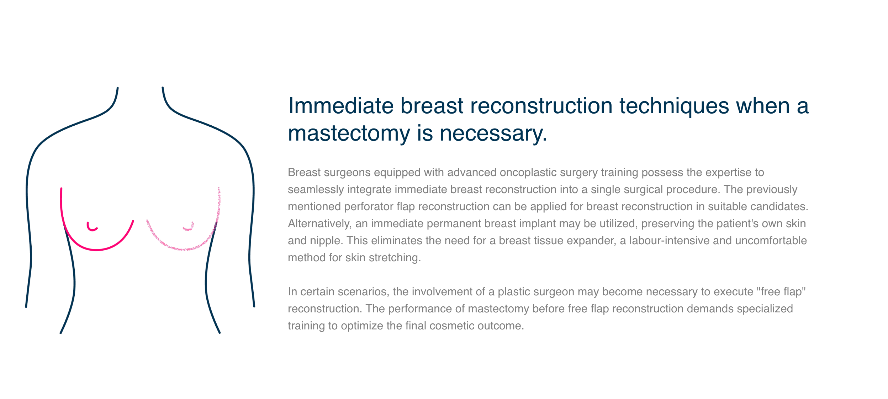

Use this flexible content:
- `Illustration + Text Split Section`

What to fill in:
- Image Position: `Left`
- Section Heading
- Body Content
- Section Image

### Section 7: Links to Additional Information

Screenshot:
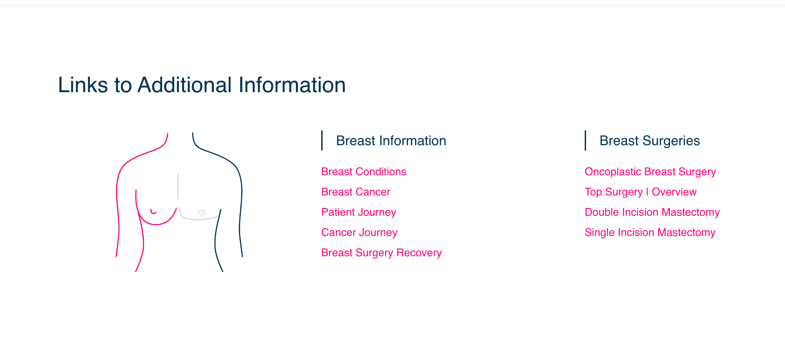

Use this flexible content:
- `Additional Information Links`

## For Future Pages

When a new page is ready, add it in this same format:

### Page Name

### Section 1: Section Name

Screenshot:
- add screenshot here

Use this flexible content:
- `Section Name`

What to fill in:
- field 1
- field 2

Notes:
- any important instruction
